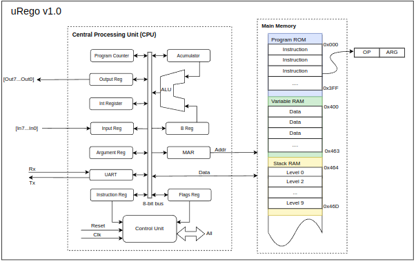

# uRego
8-bit Von Neumann Microcontroller made with VHDL

## uRego Architecture

 

## uRego Instruction Set

| mnemonic | Arg   | OpCode | Description          | T cyc |  flags |
| ---     | ---    | ---    | ---                  | ---   | ---    |
| nop     | -      | 0x00   | No operation         | ?     |  -     |
| lda     | addr.  | 0x01   | ACC = VAR[addr]      | ?     |  Z     |
| add     | Lit.   | 0x02   | ACC = ACC + B (Lit.) | ?    |  C,Z   |
| sub     | Lit.   | 0x03   | ACC = ACC - B(Lit.)  | ?    |  C,Z   | 
| hlt     | -      | 0x09   | Locks processing     | ?    |   -     |
| oti     | -      | 0x0F   | OTR = ACC            |      |    -   |
